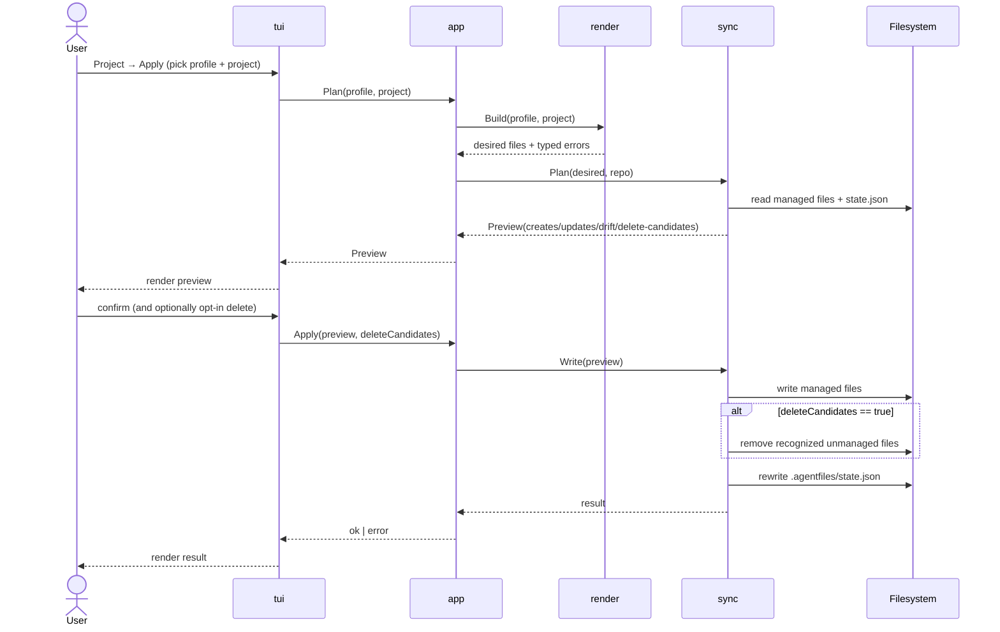

# 6. Runtime View

The runtime behavior is best understood through a few core scenarios. Every
scenario starts from the TUI. Running `af` opens the alt-screen Bubble Tea
shell on the Welcome screen; the user navigates from there to the screen
that owns the operation (Profiles, Project Detail, …). There are no direct
subcommand paths.

## Scenario: Create A Profile

1. The user reaches the Profiles screen and triggers Create.
2. A modal collects display name and target path.
3. The application normalizes the requested path.
4. The profile package creates the profile folder structure.
5. The registry package appends a new profile reference to
   `~/.agentprofiles.json`.
6. The action's bridge command emits a `NotificationMsg`; the shell
   writes it to the log and surfaces the toast above the status bar.

## Scenario: Plan A Project

1. The user reaches the Edit Profile screen, focuses the Projects table,
   and triggers `[Plan]` (mnemonic `p`) on a row. The Select Project Assets
   screen also exposes `[Plan]` for direct entry once the asset selection
   is set.
2. The Plan Project screen pushes onto the stack. Its `Init` calls
   `actions.LoadProject`, `actions.LoadProfile`, and `actions.PlanProject`
   in sequence and folds the triplet into a single load envelope.
3. `actions.PlanProject` delegates to `app.Service.Plan`, which builds the
   render plan and asks `sync.Plan` to classify every entry as create,
   update, drift, delete, or unknown.
4. The screen renders the `Preview.Changes` as a treetable. Two value
   columns expose `Status` and `Current Action`; an Actions column shows
   a single mnemonic toggle button on drift and unknown rows.
5. The user toggles per-row resolutions (`o`/`k`/`d`). Defaults are
   `Keep` for both drift and unknown, encoded as absence from the
   screen's resolution map.
6. Pressing `[Apply]` (mnemonic `a`) builds `[]app.DriftResolution` +
   `[]app.UnknownResolution` slices and calls `actions.SyncProject` →
   `app.Service.Apply` → `llmsync.Apply`. On success the screen
   surfaces a `Project synced` notification and pops back to the
   previous screen; on failure it stays put with the error toast.

## Scenario: Apply A Project

The apply flow is the most complex runtime path because it mutates the
target repository. The sequence below shows the order of operations and the
gating prompts.

1. The user reaches the Project Detail screen for the profile + project.
2. They trigger Apply; a preview is generated and rendered first.
3. If delete candidates exist, the screen asks whether to remove them.
4. A confirmation modal gates the write step.
5. Files are written to the target repository.
6. If the user opted to delete candidates, recognized unmanaged files are
   removed.
7. `.agentfiles/state.json` is updated with new managed-file hashes.
8. The bridge command emits a `NotificationMsg`; success or failure
   shows as a toast and is appended to the in-memory log.
