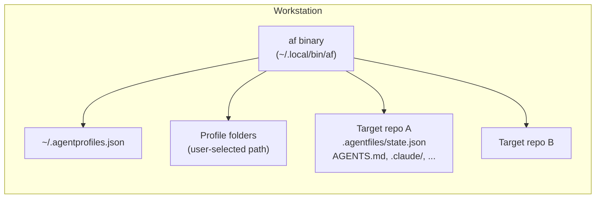

# 7. Deployment View

The current system is deployed only as a local developer tool. There is no
server-side runtime and no distributed deployment topology.

## Topology

Everything runs inside one workstation process. The binary holds no state
of its own; all persistence is on the local filesystem.

## Runtime Environment

- User workstation
- Go binary: `af` (installed at `~/.local/bin/af` by `make build`)
- Local profile storage
- Local target repositories

## Relevant Locations

- Binary install path: `~/.local/bin/af`
- Global registry: `~/.agentprofiles.json`
- Profile root: user-selected local path
- Managed project state: `<repo>/.agentfiles/state.json`
- Rendered agent files:
  - `AGENTS.md`
  - `.claude/`
  - `.cursor/`
  - `.codex/`
  - `.opencode/`
  - `.mcp.json`

## Deployment Characteristics

The deployment model is intentionally simple. The main architectural concern is
safe file synchronization on a local filesystem rather than service orchestration.
