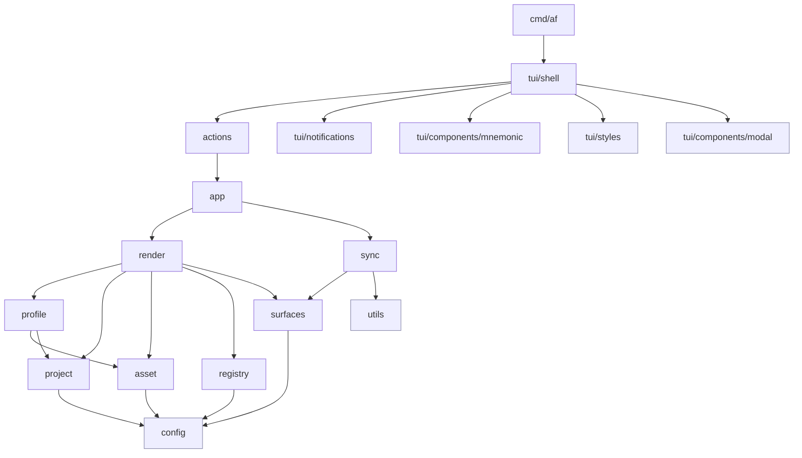

# 5. Building Block View

The implementation is split into small packages around the domain model and the
main workflow.

## Level 1: Package Dependency Overview

`config`, `errs`, and `utils` are leaf packages that the rest of the
codebase reads from but that import nothing internal. They are highlighted
in blue above to make the dependency direction visible. The TUI layer
reaches `app` only through the `actions` adapter; nothing else imports `app`.

## Level 2: Package Responsibilities

### `config`

Centralizes file/directory names and default profile metadata shared by more
than one domain package. Has no internal dependencies and sits at the bottom
of the import graph; every other domain package reads its constants from
here so a single edit changes behavior everywhere.

### `surfaces`

Owns the managed-surface root list and the `IsAllowed(target)` matcher that
gates writes into a target repository. Render consults it to refuse
projection targets outside the fence; sync iterates `Roots()` to find
delete candidates. Co-locates the data and the rule so both halves of the
safety fence stay in one package.

### `registry`

Loads and saves `~/.agentprofiles.json`, resolves profiles, and tracks metadata
such as last-opened timestamps.

### `profile`

Initializes and loads profile folders. A profile contains `profile.json`,
`assets/`, and `projects/`.

### `asset`

Defines asset types, validates asset manifests, and scaffolds new assets. Asset
types currently include `skill`, `agents_doc`, `settings`, `mcp`, `rule`, and
`hook`.

### `project`

Defines per-project manifests containing the target path, enabled agents, and
selected asset ids.

### `errs`

Cross-package error vocabulary: the `Severity` enum, the `DomainError`
interface (`error` + `Severity()`), the `Errors` slice that itself
satisfies `error`, and a `Collect` helper that flattens both
`Unwrap() []error` and `Unwrap() error` chains. The package is
deliberately leaf-only — it imports nothing internal — so any domain
package can depend on it without risking an import cycle.

### `utils`

Path, JSON, and content-hashing helpers plus small generic utilities
(e.g. `Deduplicate`) shared by the rest of the codebase. Like `errs` and
`config`, it is a leaf package with no internal imports.

### `render`

Builds a project plan by resolving selected assets and projecting them into
agent-specific output paths. Returns structured data and typed errors only;
loop failures (missing assets, exclusive-group conflicts, per-asset render
failures) are accumulated and returned as `[]errs.DomainError` so the TUI
can list every issue in one preview.

### `sync`

Calculates preview changes (create / update / drift / delete / unknown),
applies per-file `FileResolution` decisions, writes files, and stores
managed state in `.agentfiles/state.json`. Sync produces a `Preview`
struct; turning that struct into user-facing text is the TUI's job
(see `tui.RenderPreview`). First-apply (no `.agentfiles/state.json`) is
treated as a clean slate — every desired file is `ChangeCreate`, no
`ChangeUnknown` entries are emitted. See ADR 0010.

### `app`

Coordinates the higher-level operations used by the TUI: profile creation,
project ownership checks, planning, and apply. Accumulator-shape calls
return `[]errs.DomainError`; non-accumulator calls wrap render slices in
`errs.Errors` and return a single `error`. Typed-error conventions live in
[`docs/guidelines/errors.md`](../guidelines/errors.md).

### `tui/shell`

The root Bubble Tea program. Runs in alt-screen mode, owns the screen
router stack (`PushScreenMsg` / `PopScreenMsg`), intercepts the global
key set (`n` notifications, `s` settings, `?` info, `q` quit) before
the active screen sees them, mounts the toast widget above the status
bar, and forwards everything else to the top-of-stack `Screen`. The
status bar joins a fixed global set of hints with each screen's
dynamic `StatusKeys()` (the focused row's mnemonic bindings) without
duplicating screen-level labelled buttons. Screens that render entity
data live next to the shell; the package itself ships a placeholder
Welcome plus three stubs that stand in for the Notifications modal,
Settings screen, and Info modal until tasks 0023 and 0024 land.
Rationale and routing rules: ADR 0011.

### `tui/notifications`

In-memory `Log` (a 500-entry ring buffer of typed
`Notification{Severity, Text, CreatedAt}` values), the FIFO `Toast`
widget that shows one notification at a time for 5 s, and the
`From()` bridge command that wraps any action so success and failure
both turn into a single `NotificationMsg` carrying the domain
severity. The shell routes every `NotificationMsg` into both the
log and the toast. Severity styling shares the palette from
`tui/styles` so the toast and the future Notifications modal render
identically (ADR 0007).

### `tui/styles`

Leaf package holding the palette, named lipgloss styles, severity
→ icon/style switch (`SeverityStyle`), and the terminal-safe string
sanitizer. Imported by both the shell and the notifications package
so the styles vocabulary stays in one place.

### `tui/components/modal`

A reusable Bubble Tea overlay component. It wraps any `Content`
(anything with `Init`/`Update`/`View`/`Resolution`), centers it as a
`lipgloss.Layer` via the v2 compositor, and resolves through a typed
`modal.ResolvedMsg{ID, Confirmed, Value}`. `modal.NewForm` adapts a
`*huh.Form` into a `Content`, calling a caller-supplied `extract` closure
on completion so `*huh.Form` does not leak past the modal boundary.

The package is a **leaf**: it imports only `charm.land/{bubbletea,
lipgloss,huh}/v2` and nothing from `internal/`. That keeps it free of
cycle risk so any future `internal/tui` flow can pull it in. Themed
borders come from `internal/tui/styles.go` (`modalStyle`) passed in via
`modal.WithStyle`, not from inside the package itself. The
`components/<name>/` layout is the home for future reusable widgets
(picker, confirm dialog, …) that follow the same leaf contract.

### `cmd/af`

The binary entry point. It parses the single `--registry` flag with the
standard-library `flag` package, builds the `app.Service`, wraps it with
`actions.New`, allocates a `notifications.Log`, and hands the trio to
`shell.New` before running `tea.NewProgram(...).Run()`. There is no
Cobra command tree and no intermediate routing package — `af` always
opens the alt-screen shell.
