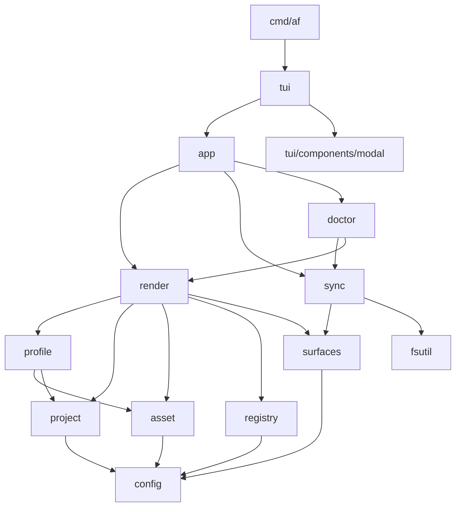

# 5. Building Block View

The implementation is split into small packages around the domain model and the
main workflow.

## Level 1: Package Dependency Overview

`config`, `errs`, and `fsutil` are leaf packages that the rest of the
codebase reads from but that import nothing internal. They are highlighted
in blue above to make the dependency direction visible. The TUI layer
imports `app`; nothing else does.

## Level 2: Package Responsibilities

### `config`

Centralizes file/directory names and default profile metadata shared by more
than one domain package. Has no internal dependencies and sits at the bottom
of the import graph; every other domain package reads its constants from
here so a single edit changes behavior everywhere.

### `surfaces`

Owns the managed-surface root list and the `IsAllowed(target)` matcher that
gates writes into a target repository. Render consults it to refuse
projection targets outside the fence; sync iterates `Roots()` to find
delete candidates. Co-locates the data and the rule so both halves of the
safety fence stay in one package.

### `registry`

Loads and saves `~/.agentprofiles.json`, resolves profiles, and tracks metadata
such as last-opened timestamps.

### `profile`

Initializes and loads profile folders. A profile contains `profile.json`,
`assets/`, and `projects/`.

### `asset`

Defines asset types, validates asset manifests, and scaffolds new assets. Asset
types currently include `skill`, `agents_doc`, `settings`, `mcp`, `rule`, and
`hook`.

### `project`

Defines per-project manifests containing the target path, enabled agents, and
selected asset ids.

### `errs`

Cross-package error vocabulary: the `Severity` enum, the `DomainError`
interface (`error` + `Severity()`), the `Errors` slice that itself
satisfies `error`, and a `Collect` helper that flattens both
`Unwrap() []error` and `Unwrap() error` chains. The package is
deliberately leaf-only — it imports nothing internal — so any domain
package can depend on it without risking an import cycle.

### `fsutil`

Path, JSON, and content-hashing helpers shared by the rest of the codebase.
Like `errs` and `config`, it is a leaf package with no internal imports.

### `render`

Builds a project plan by resolving selected assets and projecting them into
agent-specific output paths. Returns structured data and typed errors only;
loop failures (missing assets, exclusive-group conflicts, per-asset render
failures) are accumulated and returned as `[]errs.DomainError` so the TUI
can list every issue in one preview.

### `sync`

Calculates preview changes, detects drift, detects recognized delete
candidates, writes files, and stores managed state in `.agentfiles/state.json`.
Sync produces a `Preview` struct; turning that struct into user-facing text
is the TUI's job (see `tui.RenderPreview`).

### `doctor`

Runs a sync plan for every project owned by a profile and returns a
`*doctor.Report` with one `ProjectStatus` per project, plus a
`[]errs.DomainError` of any per-project failures so successful projects
still render alongside broken ones. Doctor owns its own `ChangeKind` /
`ProjectChange` vocabulary so callers do not need to import `internal/sync`
just to read a report. Doctor never formats output; the TUI renders the
report.

### `app`

Coordinates the higher-level operations used by the TUI: profile creation,
project ownership checks, planning, and apply. Accumulator-shape calls
return `[]errs.DomainError`; non-accumulator calls wrap render slices in
`errs.Errors` and return a single `error`. Typed-error conventions live in
[`docs/guidelines/errors.md`](../guidelines/errors.md).

### `tui`

Implements every interactive flow on top of `huh`: the top-level menu, the
per-category submenus, and one form per command. Free-form fields use text
inputs while closed sets (asset types, supported agents, registered profiles,
profile-owned projects, profile-owned assets) use Select / MultiSelect
populated from the domain layer. Every command lives here; no other package
collects user input. A local `runForm` helper installs a keymap that treats
Esc the same as Ctrl+C so every prompt aborts consistently when the user
wants to back out one level.

The TUI is also the only place that turns domain values into styled text.
`RenderPreview`, `RenderReport`, and `RenderError` consume sync, doctor, and
typed-error values respectively, applying lipgloss styles defined once in
`internal/tui/styles.go`. ADR 0007 captures the rationale.

### `tui/components/modal`

A reusable Bubble Tea overlay component. It wraps any `Content`
(anything with `Init`/`Update`/`View`/`Resolution`), centers it as a
`lipgloss.Layer` via the v2 compositor, and resolves through a typed
`modal.ResolvedMsg{ID, Confirmed, Value}`. `modal.NewForm` adapts a
`*huh.Form` into a `Content`, calling a caller-supplied `extract` closure
on completion so `*huh.Form` does not leak past the modal boundary.

The package is a **leaf**: it imports only `charm.land/{bubbletea,
lipgloss,huh}/v2` and nothing from `internal/`. That keeps it free of
cycle risk so any future `internal/tui` flow can pull it in. Themed
borders come from `internal/tui/styles.go` (`modalStyle`) passed in via
`modal.WithStyle`, not from inside the package itself. The
`components/<name>/` layout is the home for future reusable widgets
(picker, confirm dialog, …) that follow the same leaf contract.

### `cmd/af`

The binary entry point. It parses the single `--registry` flag with the
standard-library `flag` package and calls `tui.Run`. There is no Cobra
command tree and no intermediate routing package — `af` always opens the
TUI.
