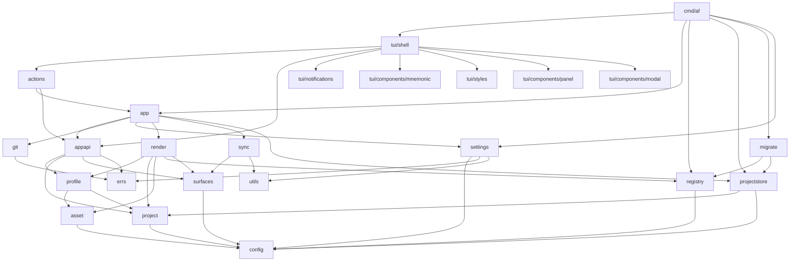

# 5. Building Block View

The implementation is split into small packages around the domain model and the
main workflow.

## Level 1: Package Dependency Overview

The shell imports the component packages directly: `mnemonic` for labelled
buttons, `modal` for the help and notifications overlays (ADR 0013), and
`panel` for the reusable captioned frame. `tui/styles`, `tui/components/modal`,
and `tui/components/panel` are leaf components (highlighted blue) that import
nothing from `internal/`. The real entity screens (Profiles, Edit Profile,
Edit Asset, Select Project Assets, Plan Project) all live in `tui/shell`; the
Plan Project screen renders the sync `Preview` through a treetable and
dispatches `actions.SyncProject` on `[Apply]`.

`config`, `errs`, and `utils` are leaf packages that the rest of the
codebase reads from but that import nothing internal. They are highlighted
in blue above to make the dependency direction visible. The TUI layer
reaches `app` only through the `actions` adapter; the binary at `cmd/af`
wires both `app` and `registry` as the composition root and is the only
other importer.

## Level 2: Package Responsibilities

### `config`

Centralizes file/directory names and default profile metadata shared by more
than one domain package. Has no internal dependencies and sits at the bottom
of the import graph; every other domain package reads its constants from
here so a single edit changes behavior everywhere.

### `surfaces`

Owns two nested safety fences and the matchers that enforce them.

The **outer fence** is the managed-surface root list: the set of top-level
paths render is allowed to project into and sync is allowed to walk for
delete candidates. Render consults `IsAllowed(target)` to refuse projection
targets outside the fence; sync iterates `Roots()` to find delete candidates.

The **inner fence** is the tighter asset-container-root set — the strict
subset of the outer fence (`.claude/skills`, `.codex/skills`,
`.opencode/skills`, `.cursor/commands`) whose direct child folders are
eligible for folder-based asset registration. `AssetContainerRoots()` and
its O(1) `IsAssetContainerRoot` predicate expose the set; `RegisterableFolders`
implements the eligibility rule (parent-must-be-root + every descendant
leaf unknown); and `ClassifyFolderRejection` returns a `FolderRejectionReason`
so `app.FolderNotRegisterableError` can carry a typed reason
(`ReasonNotUnderContainerRoot` / `ReasonHasManagedDescendants` /
`ReasonAbsentFromPlan`) that the TUI renders as a targeted message.

The per-agent `SkillRoot(agent)` accessor and `CursorCommandsRoot()` also
live here so `render.addSkillOutputs` reads its container roots from the
same source `app.RegisterableDirs` uses — no caller duplicates the list.
Co-locating both fences in one package keeps every safety rule next to the
data it fences.

### `registry`

Loads and saves the profile registry at `~/.agentfiles/profiles.json`,
resolves profiles, and tracks metadata such as last-opened timestamps.
The registry file lives inside the user-config dir alongside the projects
store (ADR 0017).

### `profile`

Initializes and loads profile folders. A profile contains `profile.json`
and `assets/`; per-user project selections live in the projects store,
not inside the profile folder (ADR 0017). `Profile.Projects` is retained
as an in-memory convenience projection composed by `app.Service.LoadProfile`.

### `projectstore`

Owns `~/.agentfiles/projects.json`, the centralized per-user project
selection file introduced by ADR 0017. Exposes `Load` (with an orphan
check against the current registry), `Save`, and typed CRUD (`Add`,
`Update`, `Remove`, `ListByProfile`, `RemoveByProfile`, `AllProjects`)
so the app layer talks to one aggregate rather than walking every
profile folder. `AllProjects` is the single-pass source that
`app.Service.ensureProjectPathAvailable` uses to enforce
CLAUDE.md invariant #5.

### `migrate`

One-shot user-config migration runner invoked from `cmd/af/main.go`
before the TUI opens. Detects the v1 layout (`~/.agentprofiles.json` +
per-profile `projects/` subdirectories), harvests it into v2 shape,
writes-then-swaps into `~/.agentfiles/`, and deletes the originals.
Idempotent by presence check; injectable logger captures non-fatal
warnings (stale profile paths, best-effort cleanup failures) without
touching stderr. See ADR 0017 for the full flow.

### `asset`

Defines asset types, validates asset manifests, and scaffolds new assets. Asset
types currently include `skill`, `agents_doc`, `settings`, `mcp`, `rule`, and
`hook`.

### `project`

Defines the per-project manifest struct (target path, enabled agents,
selected asset ids) plus `NewDraft`, `Validate`, and `Normalize`. The
package is content-only; persistence lives in `projectstore` so the
profile folder can be shared without leaking per-user selections.

### `errs`

Cross-package error vocabulary: the `Severity` enum, the `DomainError`
interface (`error` + `Severity()`), the `Errors` slice that itself
satisfies `error`, and a `Collect` helper that flattens both
`Unwrap() []error` and `Unwrap() error` chains. The package is
deliberately leaf-only — it imports nothing internal — so any domain
package can depend on it without risking an import cycle.

### `utils`

Path, JSON, and content-hashing helpers plus small generic utilities
(e.g. `Deduplicate`) shared by the rest of the codebase. Like `errs` and
`config`, it is a leaf package with no internal imports.

### `render`

Builds a project plan by resolving selected assets and projecting them into
agent-specific output paths. Returns structured data and typed errors only;
loop failures (missing assets, exclusive-group conflicts, per-asset render
failures) are accumulated and returned as `[]errs.DomainError` so the TUI
can list every issue in one preview.

### `sync`

Calculates preview changes (create / update / drift / delete / unknown),
applies per-file `FileResolution` decisions, writes files, and stores
managed state in `.agentfiles/state.json`. Sync produces a `Preview`
struct; turning that struct into user-facing text is the TUI's job
(see `tui.RenderPreview`). First-apply (no `.agentfiles/state.json`) is
treated as a clean slate — every desired file is `ChangeCreate`, no
`ChangeUnknown` entries are emitted. See ADR 0010.

### `app`

Coordinates the higher-level operations used by the TUI: profile creation,
project ownership checks, planning, and apply. Accumulator-shape calls
return `[]errs.DomainError`; non-accumulator calls wrap render slices in
`errs.Errors` and return a single `error`. Typed-error conventions live in
[`docs/guidelines/errors.md`](../guidelines/errors.md).

`app.Service` also owns the `GitCommitter` seam (`internal/app/git.go`)
and the discriminated `appapi.CommitOutcome` value (`appapi.Committed`,
`appapi.Skipped`, `appapi.Failed`) that `Service.UpdateAsset`,
`Service.SaveAssetFilesEdit`, and `Service.Apply` return alongside
their existing outputs. The concrete committer (`gitBinaryCommitter`)
wraps `internal/git` and is the sole anti-corruption layer between the
git wrapper's typed errors and the boundary values; unit tests inject
a fake. `Service.Settings()` and `Service.UpdateSettings()` expose the
loaded settings and persist changes through the settings store,
running `GitCommitter.BinaryAvailable()` as an injectable pre-flight
when the toggle is about to enable git integration (no `internal/git`
import in `service.go`). All reads and writes to the cached settings
value go through an `RWMutex` so concurrent Bubble Tea cmds
(`PlanProject` reading `commitEnabled()` on one goroutine while
`UpdateSettings` runs on another) serialize. See ADR 0019.

### `appapi`

Boundary value types shared by the TUI, the actions layer, and the
app service — `CommitOutcome` (discriminated: `Committed`, `Skipped`,
`Failed` with a `SkipReason` for each skip flavor), `Preview`,
`FileChange`, `ChangeKind`, `DriftDecision` / `UnknownDecision`,
`LoadedProfile`, `Resolutions`, plus the helpers `RegisterableDirs`,
`DesiredIgnored`, `DriftResolutionsFromMap`, and `SanitizeSubject`.
The leaf lives here so the documented `tui/shell → actions → app`
edge stays honest: shell reads value types from this package and
never imports `internal/app`. Depends only on `profile`, `project`,
`surfaces`, and `errs`.

### `settings`

Owns `~/.agentfiles/settings.json`, the persistent user-preferences file
introduced by ADR 0019. Schema `{version:1, git:{enabled, run_hooks}}`.
`Store` mirrors `projectstore.Store` / `registry.Store` shape (`Load`,
`Save`, `DefaultPath`, `NewStore`) so `cmd/af/main.go` wires all three
the same way. Missing file → `Default()` with no error so first-time
users start with the safe (git-disabled) default. `run_hooks` defaults
to `false` so the auto-commit path passes `--no-verify` and cannot
execute a hostile checked-out `.git/hooks/pre-commit`; users who
depend on hooks opt in explicitly (ADR 0019).

### `git`

Narrow wrapper around the `git` binary via `os/exec`, per
`docs/guidelines/external_tools.md`. Files: `git.go` (`Repo`,
`Detect`, `BinaryAvailable`, filtered exec adapter), `commit.go`
(`Repo.Commit` + `ensureCoveredBy` / `commitOrSkip` helpers),
`pathspec.go` (`Covers`, `toRepoRelative`, `toGitPathspec`, symlink
resolution), `hooks.go` (hook-stderr marker classifier +
`hookInstalled` fallback), `errors.go` (typed errors).
`Repo.Commit(pathspec, msg, runHooks)` refuses when staged paths lie
outside the pathspec, returns `("", nil)` on an empty diff (silent
skip), re-verifies the staged index after `git add` to close the
TOCTOU window against a concurrent `git add`, and passes
`--no-verify` unless `runHooks` is true (ADR 0019). The child
environment is filtered so inherited `GIT_*` variables cannot
redirect the child; `filepath.EvalSymlinks` resolves both `Repo.Root`
and each pathspec entry so a symlinked profile folder cannot smuggle
paths outside the work tree. Typed errors (`BinaryMissingError`,
`NotARepoError`, `UnrelatedStagedChangesError`, `HookFailedError`,
`CommitError`) let the TUI render specific messages;
`HookFailedError` / `CommitError` carry a `Detail` field (renamed
from `Stderr`) that holds either git's stderr or the exec fallback
summary. Consumed only by `internal/app` — the rest of the codebase
sees the `GitCommitter` seam instead.

### `tui/shell`

The root Bubble Tea program. Runs in alt-screen mode, owns the screen
router stack (`PushScreenMsg` / `PopScreenMsg`), intercepts the global
key set (`n` notifications, `s` settings, `?` help, `q` quit) before
the active screen sees them, mounts the toast widget above the status
bar, and forwards everything else to the top-of-stack `Screen`. Help
and notifications are not stack screens: the shell owns them as
`modal.Modal` overlays (`helpModal` / `notificationsModal`) so the
global quit binding stays live while a dialog is open (ADR 0013). Each
`Screen` contributes a `Title()` and a `Description()`; the shell
renders the muted description row under the title (`chromeHeight` = 7).
The status bar joins a fixed global set of hints with each screen's
dynamic `StatusKeys()` (the focused row's mnemonic bindings) without
duplicating screen-level labelled buttons. The real entity screens
(Welcome, Profiles, Edit Profile, Edit Asset, Select Project Assets,
Settings, Plan Project) live next to the shell. Rationale and routing
rules: ADR 0011.

### `tui/notifications`

In-memory `Log` (a 500-entry ring buffer of typed
`Notification{Severity, Text, CreatedAt}` values), the FIFO `Toast`
widget that shows one notification at a time for 5 s, and the
`From()` bridge command that wraps any action so success and failure
both turn into a single `NotificationMsg` carrying the domain
severity. The shell routes every `NotificationMsg` into both the
log and the toast. Severity styling shares the palette from
`tui/styles` so the toast and the future Notifications modal render
identically (ADR 0007).

### `tui/styles`

Leaf package holding the theming engine. `palette.go` defines the
semantic `Palette` (color roles, not shades) and `DefaultPalette()`;
`styles.go` rebuilds every exported lipgloss style through
`Apply(Palette)` — the single edit-point for a palette swap — and an
`init()` seeds it with the defaults. `huh.go` (`HuhTheme()`) and
`table.go` (`TableStyles()`) derive the form and table styles from the
active palette. `config.go` adds an optional external override:
`LoadConfig(path)` merges a `theme.json` (default
`$XDG_CONFIG_HOME/agentfiles/theme.json`) over the defaults, returning
typed `ConfigReadError` / `ConfigParseError`; a missing file is a
no-op. The package also holds the severity → icon/style switch
(`SeverityStyle`) and the terminal-safe string sanitizer. Imported by
the shell, the components, and the notifications package so the styles
vocabulary stays in one place. See ADR 0012.

### `tui/components/modal`

A reusable Bubble Tea overlay component. It wraps any `Content`
(anything with `Init`/`Update`/`View`/`Resolution`), centers it as a
`lipgloss.Layer` via the v2 compositor, and resolves through a typed
`modal.ResolvedMsg{ID, Confirmed, Value}`. `modal.NewForm` adapts a
`*huh.Form` into a `Content`, calling a caller-supplied `extract` closure
on completion so `*huh.Form` does not leak past the modal boundary.

The package is a **leaf**: it imports only `charm.land/{bubbletea,
lipgloss,huh}/v2` and nothing from `internal/`. That keeps it free of
cycle risk so any `internal/tui` flow can pull it in. A modal frame is
configured with `modal.WithCaption(caption)` (drawn through the `panel`
component) or `modal.WithStyle`; `modal.Active()` reports whether a
modal is open and unresolved. The shell uses these for the help and
notifications overlays (ADR 0013). The `components/<name>/` layout is
the home for reusable widgets that follow the same leaf contract.

### `tui/components/panel`

Leaf presentation component. `Render(focused, caption, body, Styles)`
draws a rounded frame with the caption spliced into the top border, and
`DefaultStyles()` supplies the palette-derived look. The frame logic was
extracted from `treetable` so the treetable, modal captions, and any
future framed widget share one implementation.

### `tui/modals/pathselector`

Reusable file/folder-picker modal opened by callers through the
`modals.NewSelectPath(opts)` wrapper. The package owns a `modal.Content`
implementation that combines the shared `treetable` (flat root, per-row
`[Select]` actions column) with three screen-level mnemonic buttons —
`[Select current]`, `[Show hidden] / [Hide hidden]`, and `[Cancel]` —
and returns the user's choice as a typed `pathselector.Result{Path,
IsDir}` through `modal.ResolvedMsg`. It is safety-critical: navigation
above a caller-supplied `Options.Constraint` is rejected (the `..` row
is absent at the constraint root) and, when `Options.FollowSymlinks` is
enabled, symlink targets are `EvalSymlinks`-resolved and refused if
they escape the constraint — an error `notifications.NotificationMsg`
is emitted in that case. Read failures on `os.ReadDir` (permission
denied, folder disappeared) surface through the same notification path
without changing the current folder; the modal never resolves on an
I/O error. The Create Profile, Register Profile, and Register Project
flows now open this modal as their first step: the picker collects the
directory, the follow-on form shows the picked path as a display-only
`huh.Note` row (no runtime edits, Enter advances the form) and only
collects the remaining inputs (Name, EnabledAgents).
Cancelling the picker aborts the flow; a failing action re-opens the
picker seeded at the parent of the previously-picked folder so the
retry stays close to the user's chosen location.

### `cmd/af`

The binary entry point. It parses the `--registry`, `--projects`, and
`--theme` flags with the standard-library `flag` package, builds both
centralized stores, invokes `migrate.Run` (a no-op after the first
successful run), builds the `app.Service` via `app.NewWithStores`, wraps
it with `actions.New`, allocates a `notifications.Log`, and hands the
trio to `shell.New` before running `tea.NewProgram(...).Run()`. There is
no Cobra command tree and no intermediate routing package — `af` always
opens the alt-screen shell.

## Task-workflow Skill Contract

Alongside the Go packages above, the repository ships a three-stage task
workflow implemented entirely in Claude Code skills — `af.create-task` →
`af.task.implement` → `af.task.review` — with `af.task.review-apply` as
the follow-up that applies chosen review fixes. These skills are not Go
packages, but they share an inter-skill contract that behaves like a
package boundary: every `description.md` produced by `af.create-task`
must carry the three required body sections (`## Acceptance Criteria`,
`## Out of scope`, `## Verification`), and both downstream skills refuse
to run when any section is missing (`LegacyTask` outcome). The Definition
of Done is the [Acceptance Criteria](../glossary.md#acceptance-criteria)
checklist plus a passing [`## Verification`](../glossary.md#definition-of-done);
`af.task.review` Step 6.5 enforces it via three substeps (contract
presence, DoD evidence table, scope-creep audit) before dispatching its
review subagents. Rationale and alternatives considered: ADR 0016.
