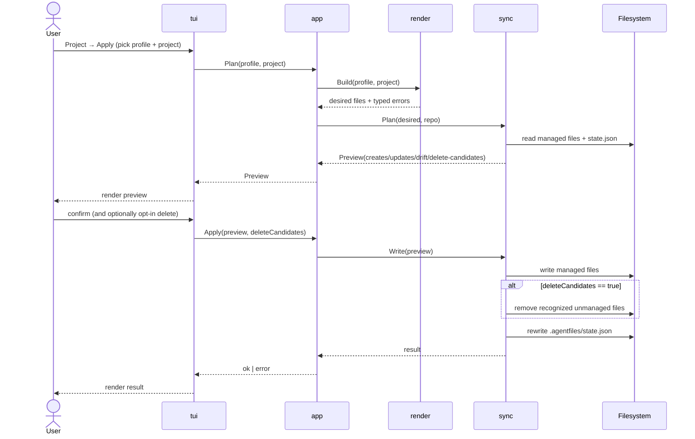
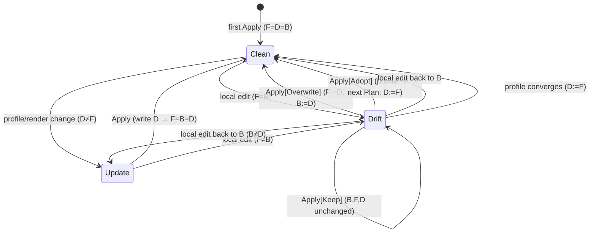

# 6. Runtime View

The runtime behavior is best understood through a few core scenarios. Every
scenario starts from the TUI. Running `af` opens the alt-screen Bubble Tea
shell on the Welcome screen; the user navigates from there to the screen
that owns the operation (Profiles, Project Detail, …). There are no direct
subcommand paths.

## Startup: User-Config Migration

Before the shell opens, `cmd/af/main.go` invokes `migrate.Run` against the
current registry and projects stores. When the v1 layout is detected
(`~/.agentprofiles.json` plus per-profile `projects/` subdirectories), the
runner harvests it into the v2 shape under `~/.agentfiles/`, writes the
two v2 files, and removes the originals. Detection is presence-based so
subsequent launches are a fast no-op — the migration never runs twice.
Non-fatal events (stale profile paths, best-effort cleanup failures) are
logged via the injected `Logger` rather than aborting startup. See
ADR 0017.

## Scenario: Create A Profile

1. The user reaches the Profiles screen and triggers Create.
2. A modal collects display name and target path.
3. The application normalizes the requested path.
4. The profile package creates the profile folder structure.
5. The registry package appends a new profile reference to
   `~/.agentfiles/profiles.json`.
6. The action's bridge command emits a `NotificationMsg`; the shell
   writes it to the log and surfaces the toast above the status bar.

## Scenario: Plan A Project

1. The user reaches the Edit Profile screen, focuses the Projects table,
   and triggers `[Plan]` (mnemonic `p`) on a row. The Select Project Assets
   screen also exposes `[Plan]` for direct entry once the asset selection
   is set.
2. The Plan Project screen pushes onto the stack. Its `Init` calls
   `actions.LoadProject`, `actions.LoadProfile`, and `actions.PlanProject`
   in sequence and folds the triplet into a single load envelope.
3. `actions.PlanProject` delegates to `app.Service.Plan`, which builds the
   render plan and asks `sync.Plan` to classify every entry as create,
   update, drift, delete, or unknown.
4. The screen renders the `Preview.Changes` as a treetable. Two value
   columns expose `Status` and `Current Action`; an Actions column shows
   a single mnemonic toggle button on drift and unknown rows.
5. The user toggles per-row resolutions (`o`/`k`/`d`). Defaults are
   `Keep` for both drift and unknown, encoded as absence from the
   screen's resolution map.
6. Pressing `[Apply]` (mnemonic `a`) builds `[]app.DriftResolution` +
   `[]app.UnknownResolution` slices and calls `actions.SyncProject` →
   `app.Service.Apply` → `llmsync.Apply`. On success the screen
   surfaces a `Project synced` notification and pops back to the
   previous screen; on failure it stays put with the error toast.
   When git integration is enabled and the target repo is a git
   repository, `app.Service.Apply` records a single scoped commit
   covering every mutated file plus `.agentfiles/state.json`. The
   commit's short SHA (or the commit failure) rides on the
   `CommitOutcome` the action returns; the screen merges it into the
   success toast (`Project synced (committed abc1234)`) or surfaces a
   warn toast when the commit fails. See ADR 0019.

## Scenario: Apply A Project

The apply flow is the most complex runtime path because it mutates the
target repository. The sequence below shows the order of operations and the
gating prompts.



1. The user reaches the Project Detail screen for the profile + project.
2. They trigger Apply; a preview is generated and rendered first.
3. If delete candidates exist, the screen asks whether to remove them.
4. A confirmation modal gates the write step.
5. Files are written to the target repository.
6. If the user opted to delete candidates, recognized unmanaged files are
   removed.
7. `.agentfiles/state.json` is updated with new managed-file hashes.
8. The bridge command emits a `NotificationMsg`; success or failure
   shows as a toast and is appended to the in-memory log.

## Drift Lifecycle

Classification of a single managed path is a pure function of three hashes:
`B` = baseline in `state.json`, `D` = desired (render output), `F` = on-disk
file (`classifyDesired` in `internal/sync`):

- `F==D` → **Clean** (no change row)
- `F!=D` and `F==B` → **Update** (profile moved ahead, local untouched)
- `F!=D` and `F!=B` → **Drift** (local edited away from the baseline)

`Apply[Keep]` (the drift default) leaves the file untouched **and preserves the
prior baseline `B`**, so a kept drift stays drift until the user overwrites it
or the profile/file converge. `Apply` never adopts the on-disk hash as the new
baseline — doing so silently flipped drift to update (bug 0033).



Promoting a local edit back into the profile — **Adopt** — is now
implemented as `DriftAdopt` (see ADR 0020). Adopt keeps `F` unchanged,
copies the local body into the profile asset it came from, and lets
the next `Plan` re-render so `D` catches up (Clean edge below).
Sibling agent projections (e.g. the `.codex` mirror of an adopted
`.claude` skill file) surface as ordinary `update` rows on that next
plan — Adopt is per-file, single-agent.

```mermaid
sequenceDiagram
    actor User
    participant TUI as tui
    participant App as app
    participant Sync as sync
    participant Repo as target repo
    participant Profile as profile repo

    User->>TUI: toggle drift row → Adopt, [Apply]
    TUI->>App: SyncProject{Drift:[{path, adopt}]}
    App->>Sync: Plan + Apply(DriftAdopt)
    Sync-->>App: AdoptRequests{path, asset_id, source_rel}
    App->>Repo: read local body
    App->>Profile: write <asset.Dir>/<source_rel>
    App->>Repo: commit sync (target)
    App->>Profile: commit adopt (profile)
    App-->>TUI: syncOutcome + adoptOutcome
    TUI-->>User: toast (committed sync; profile adopt)
```

State: `Drift --> Clean` on the primary agent's projection after the
next plan; sibling projections briefly enter `Update` until the user
applies them separately.
