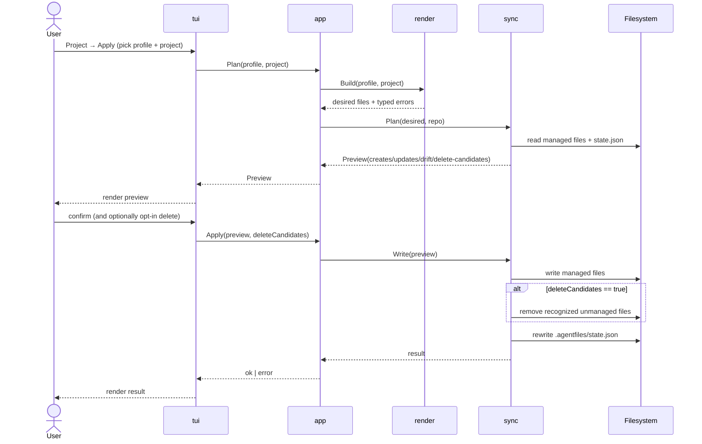

# 6. Runtime View

The runtime behavior is best understood through a few core scenarios. Every
scenario starts from the TUI. Running `af` opens the top-level menu, and the
user navigates to the matching flow from there; there are no direct
subcommand paths.

## Scenario: Create A Profile

1. The user reaches the "profile create" form by picking
   `Profile → Create` from the top-level menu.
2. The form collects display name and target path.
3. The application normalizes the requested path.
4. The profile package creates the profile folder structure.
5. The registry package appends a new profile reference to
   `~/.agentprofiles.json`.

## Scenario: Plan A Project

1. The user reaches the "project plan" form.
2. A profile selector is shown, populated from the registry.
3. After a profile is chosen, the project selector is shown, populated from
   that profile's `projects/` folder.
4. The render package resolves selected assets and builds desired outputs.
5. The sync package compares desired outputs with project files and existing
   managed state.
6. A preview is produced with create, update, drift, and delete-candidate
   entries.

## Scenario: Apply A Project

The apply flow is the most complex runtime path because it mutates the
target repository. The sequence below shows the order of operations and the
gating prompts.

1. The user reaches the "project apply" form and picks a profile and project.
2. A preview is generated and displayed first.
3. If delete candidates exist, the form asks whether to remove them.
4. A confirmation prompt gates the write step.
5. Files are written to the target repository.
6. If the user opted to delete candidates, recognized unmanaged files are
   removed.
7. `.agentfiles/state.json` is updated with new managed-file hashes.

## Scenario: Run Doctor For A Profile

1. The user reaches the "doctor" form and picks a profile.
2. The doctor package iterates every project owned by that profile.
3. For each project, doctor runs a render plan and a sync plan, capturing
   any failures as `[]errs.DomainError` without aborting the run.
4. Doctor returns a `*doctor.Report` with one `ProjectStatus` per project.
5. The TUI renders the report; broken and healthy projects appear in the
   same view so the user can act on the failing ones without losing
   context.
