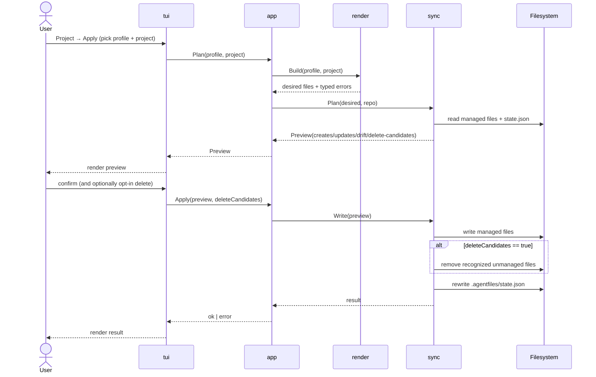

# 6. Runtime View

The runtime behavior is best understood through a few core scenarios. Every
scenario starts from the TUI. Running `af` opens the alt-screen Bubble Tea
shell on the Welcome screen; the user navigates from there to the screen
that owns the operation (Profiles, Project Detail, …). There are no direct
subcommand paths.

## Scenario: Create A Profile

1. The user reaches the Profiles screen and triggers Create.
2. A modal collects display name and target path.
3. The application normalizes the requested path.
4. The profile package creates the profile folder structure.
5. The registry package appends a new profile reference to
   `~/.agentprofiles.json`.
6. The action's bridge command emits a `NotificationMsg`; the shell
   writes it to the log and surfaces the toast above the status bar.

## Scenario: Plan A Project

1. The user reaches the Project Detail screen for the relevant profile +
   project.
2. They trigger Plan.
3. The render package resolves selected assets and builds desired outputs.
4. The sync package compares desired outputs with project files and existing
   managed state.
5. A preview is produced with create, update, drift, and delete-candidate
   entries.
6. The Project Detail screen renders the preview body inside its own area;
   the shell's notification pipeline reports any per-asset failures via
   toast + log.

## Scenario: Apply A Project

The apply flow is the most complex runtime path because it mutates the
target repository. The sequence below shows the order of operations and the
gating prompts.

1. The user reaches the Project Detail screen for the profile + project.
2. They trigger Apply; a preview is generated and rendered first.
3. If delete candidates exist, the screen asks whether to remove them.
4. A confirmation modal gates the write step.
5. Files are written to the target repository.
6. If the user opted to delete candidates, recognized unmanaged files are
   removed.
7. `.agentfiles/state.json` is updated with new managed-file hashes.
8. The bridge command emits a `NotificationMsg`; success or failure
   shows as a toast and is appended to the in-memory log.
