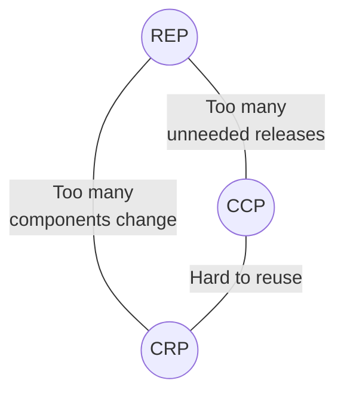

# Clean Architecture Guidelines

Related: [Clean Code](clean_code.md), [Domain Model](domain_model.md), and
[SOLID principles](solid.md).

Clean Architecture is a way to keep business rules independent from technical
details. In `agentfiles`, use it as practical guidance for package boundaries,
dependency direction, and testability. Do not add layers for their own sake.
Prefer the existing code structure unless a boundary would make the next change
clearer, safer, or easier to test.

## Core Rules

1. Keep domain policy separate from delivery and infrastructure details.
2. Source dependencies should point toward the more stable policy.
3. Put command handling, file I/O, configuration, rendering, and external tools
   at the edges of the system.
4. Let volatile details depend on stable rules, not the other way around.
5. Introduce interfaces at boundaries when they remove a concrete dependency or
   make behavior testable.
6. Avoid package cycles. Break cycles by moving shared policy inward or by using
   a narrow interface owned by the caller.
7. Start simple. Add a boundary only when the change pressure justifies it.

The goal is not a fixed folder layout. The goal is code where important rules
can be understood and tested without reconstructing every technical detail.

## Component Cohesion

Component cohesion is about deciding what belongs in the same package or module.
The useful question is: "Which code should change and be reused together?"

### Reuse / Release Equivalence Principle

The Reuse/Release Equivalence Principle says that the unit of reuse should also
be the unit of release.

Do not reuse code by copying it between packages. Copied code drifts, bug fixes
are missed, and future changes become harder to reason about. If behavior is
shared, move it to a package with a clear owner, clear tests, and a stable API
for its callers.

For this project, treat packages as the practical reuse unit. A reusable package
should expose only the concepts callers need and should not force them to know
about unrelated implementation details.

### Common Closure Principle

The Common Closure Principle says that code which changes together should live
together.

When a single requirement repeatedly forces edits across several packages, that
is a signal that the boundary may be wrong. Move the shared rule to the package
that owns the concept, or create a small coordination layer that makes the
change local.

Early in a feature, optimize for this principle before optimizing for reuse.
Developability matters more than generality when the model is still changing.

### Common Reuse Principle

The Common Reuse Principle says that callers should not depend on things they do
not use.

Keep packages and interfaces narrow. If importing a package also brings unrelated
concepts, hidden setup, or extra reasons to change, split the package or expose a
smaller API. This is the package-level version of the Interface Segregation
Principle.

### The Cohesion Tension

These three principles pull in different directions:

- REP and CCP tend to make packages larger because reused or co-changing code is
  grouped together.
- CRP tends to make packages smaller because callers should not depend on unused
  code.

Use the tension explicitly. If a package is hard to reuse, it may contain too
much. If a change touches too many packages, related policy may be split too
finely. If every package has to be released for one small change, the boundary is
probably hiding coupling instead of reducing it.

## Component Coupling

Component coupling is about dependency direction between packages.

### Acyclic Dependencies Principle

Package dependencies must not form cycles. Cycles make builds, tests, and
changes harder because no package can be understood independently.

When a cycle appears, do not work around it with global state or duplicated code.
Break it by:

1. Moving shared policy to a more central package.
2. Moving implementation detail outward.
3. Introducing a narrow interface at the boundary that needs inversion.

### Stable Dependencies Principle

Depend in the direction of stability. Stable packages are packages that many
callers use, that contain core rules, or that are expensive to change. Volatile
packages are packages near delivery mechanisms, configuration, rendering,
filesystem behavior, or other implementation details.

Stable policy should not import volatile details. Instead, the volatile detail
should call stable policy or implement an interface required by stable policy.

### Stable Abstractions Principle

A stable package should expose abstractions that let it remain useful as details
change. This does not mean every package needs an interface. It means stable
policy should avoid depending on concrete mechanisms that are likely to vary.

Use abstractions where they protect important rules from technical churn. Avoid
abstractions that only rename one concrete implementation without reducing
coupling or improving tests.

## Architecture Boundaries

Clean Architecture draws a boundary between policy and detail. Policy is what
the system means and what rules it enforces. Detail is how the system receives
input, stores data, renders output, reads files, or talks to external tools.

The dependency rule is:

> Source code dependencies point inward, toward higher-level policy.

In practical terms:

1. Domain rules should not know about the CLI, filesystem layout, environment
   variables, rendering implementation, or external commands.
2. Application services may coordinate domain rules and edge adapters, but should
   keep orchestration explicit.
3. Infrastructure code may know about domain types, but domain code should not
   know about infrastructure types.
4. Wiring belongs near the edge, where concrete implementations are chosen.
5. Tests for policy should run without real external systems whenever practical.

A good boundary gives the system these properties:

- Testable business behavior.
- Independence from UI, CLI, and framework choices.
- Independence from database, filesystem, and external tool details.
- Localized change when a technical mechanism is replaced.

This is closely related to Hexagonal Architecture: stable policy sits in the
middle, while adapters translate between that policy and the outside world.

## How To Apply This

When changing code, use this checklist:

1. Identify the policy being changed and the technical details involved.
2. Keep the policy in the package that owns the domain concept.
3. Keep side effects at the edge unless the existing design has a better local
   convention.
4. Add an interface only when there is a real boundary, variation, or test need.
5. Make dependencies point toward the stable rule.
6. Add focused tests around the policy or boundary being changed.
7. Stop before adding layers that do not pay for themselves.

The most important rule is restraint. Clean Architecture is useful when it makes
changes easier to reason about. It is harmful when it turns a simple change into
ceremony. Start with simple solutions, watch where the system changes, and add
boundaries where they make future work clearer.
