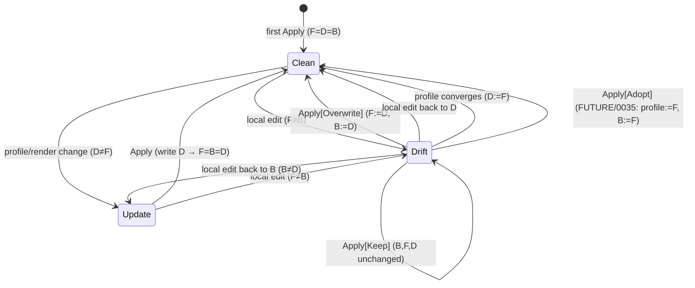

# Apply silently clears pending drift (drift → update) on an unrelated ignore-set change

## Symptom

On the **Plan Project** screen, a set of files were correctly classified as
`drift`. The user then un-ignored a persisted folder (`ask-matt`) and pressed
**Apply** — a change that should only touch `ignored_paths`. After the Apply:

- those files are now classified as **`update`** instead of `drift`, and
- their baseline hashes in the target repo's `.agentfiles/state.json` were
  rewritten to the **on-disk (drifted)** hashes.

The profile assets were **not** touched (source of truth intact). Only the
state snapshot was corrupted.

## Root cause

An Apply unconditionally bakes a default **DriftKeep** decision into every
pending drift entry, which adopts the on-disk hash as the new baseline:

1. `onApply` (`internal/tui/shell/plan_project.go`, ~L846–861) iterates
   `preview.Changes` and emits an **explicit** `app.DriftKeep` resolution for
   **every** `ChangeDrift` row — including rows the user never touched. The
   comment there states this materialization of the default is intentional.
2. `sync.Apply` `ChangeDrift` + `DriftKeep` branch
   (`internal/sync/sync.go`, ~L323–340) **adopts the on-disk hash** into
   `recordedHashes`, overwriting the prior baseline from `ManagedState`.
3. Next `Plan` (`classifyDesired`, `internal/sync/sync.go` ~L264): on-disk hash
   now equals the recorded baseline, so the drift predicate
   `state.ManagedFiles[path] != currentHash` is false → the file falls through
   to `ChangeUpdate`.

Net effect: any Apply (even one whose only real change is the ignore-set)
silently "resolves" all pending drift by adopting the local edits as baseline,
flipping `drift` → `update` and discarding the drift warning the user had not
acted on.

This is currently the **documented and tested** contract — see the `DriftKeep`
doc comment (`internal/sync/sync.go` ~L105–113) and
`TestApply_DriftKeep_AdoptsCurrentAsBaseline` /
`TestApply_DefaultDrift_LeavesAlone` (`internal/sync/sync_test.go`). So the fix
is a deliberate semantics change, not a one-line patch.

## Resolution (decided — Option B)

`DriftKeep` is redefined as **"leave alone"**: the file is untouched **and the
prior managed baseline is preserved**, so a kept drift stays classified as
`drift` on every subsequent plan until the user overwrites it or the
profile/file converge. The accidental adopt-on-disk-hash behaviour is removed
entirely.

- **`DriftKeep`** (and "no decision" — path absent from `Resolutions.Drift`):
  identical. Both leave the file and record the **prior** baseline
  (`preview.ManagedState.ManagedFiles[path]`), **not** the on-disk hash and
  **not** the rendered hash. The enum value is **kept** (redefined) for clarity
  and symmetry with `UnknownKeep`.
- **`DriftOverwrite`**: unchanged — writes the rendered body, records the
  rendered hash.

Promoting local edits *into the profile* ("Adopt") is a **separate future
feature**, tracked as task **0035**, not this fix. Adopt reverses the
source-of-truth flow (repo → profile) and gets its own enum value + UI button.

### Classification is a pure function of the three hashes

For one path: `B` = baseline in `state.json`, `D` = desired (render output),
`F` = on-disk file (per `classifyDesired`, `internal/sync/sync.go`):

- `F==D` → **Clean** (no row)
- `F!=D` and `F==B` → **Update** (profile moved, local untouched)
- `F!=D` and `F!=B` → **Drift** (local edited off baseline)

The fix simply stops Apply from mutating `B` on Keep. The bug was Apply doing
`B:=F`, which made the next plan see `F==B` → flip `drift` → `update`.

State chart for one managed path (post-fix):



The deleted bug edge: today `Apply[Keep]` does `B:=F`, turning the `Drift →
Drift` self-loop into `Drift → Update`. Option B removes it.

### Implementation notes

- `internal/sync/sync.go` — in the `Apply` `ChangeDrift` Keep branch, set
  `recordedHashes[change.Path] = preview.ManagedState.ManagedFiles[change.Path]`
  (the prior baseline), overwriting the pre-filled rendered hash. Do **not**
  hash the on-disk file. Any `ChangeDrift` row always had a prior baseline
  (drift requires `B` present), but guard a nil `ManagedState` defensively.
- `internal/tui/shell/plan_project.go` — `onApply` emits a drift resolution
  only for `DriftOverwrite` rows; untouched rows fall through to the
  preserve-baseline default. Update the doc comment that claims materializing
  the Keep default is intentional.

## Files

- `internal/sync/sync.go` — `Apply` `ChangeDrift` branch; `DriftKeep` /
  `DriftResolution` / `DriftDecision` doc comments.
- `internal/tui/shell/plan_project.go` — `onApply` drift-resolution emission.
- `internal/sync/sync_test.go` — see Tests below.
- `docs/glossary.md` — Drift entry (already updated to the leave-alone meaning).
- `docs/adr/0015-*.md` (new) — "Keep preserves baseline; Adopt is the explicit
  promote." Add a `superseded`/pointer note to the Keep clause of
  `docs/adr/0010-sync-resolutions-and-first-apply.md`.

## Tests

- After an Apply with no explicit decision for a drifting path, the next Plan
  still classifies it `ChangeDrift` and `state.json` keeps the **prior**
  baseline. (Rewrite `TestApply_DriftKeep_AdoptsCurrentAsBaseline` →
  `TestApply_DriftKeep_PreservesPriorBaseline`; update
  `TestApply_DefaultDrift_LeavesAlone` to assert baseline preserved + stays
  `ChangeDrift` on the next Plan.)
- A pure ignore-set Apply (un-ignore a persisted folder, zero file changes)
  leaves every unrelated drift baseline untouched.
- `DriftOverwrite` still writes the rendered body and records the rendered hash.

## Acceptance Criteria

- [ ] `Apply` with `DriftKeep`/no-decision preserves the prior `state.json`
      baseline for the path (neither on-disk nor rendered hash).
- [ ] A path classified `drift` stays `drift` on the next `Plan` after a Keep
      Apply — never silently becomes `update`.
- [ ] A pure ignore-set Apply leaves every unrelated drift baseline untouched.
- [ ] `DriftOverwrite` still writes the rendered body and records the rendered
      hash (regression guard).
- [ ] `onApply` emits drift resolutions only for `DriftOverwrite` rows.
- [ ] Glossary Drift entry + new ADR 0015 reflect the decision; 0010's Keep
      clause points to 0015.
- [ ] `make build && make test && make lint` pass.

## Out of scope

- **Adopt** (promote local edit into the profile) — task 0035.
- Repairing the already-corrupted `state.json` in this repo — already fixed
  by hand.
- Any new UI affordance beyond the existing Keep ↔ Overwrite toggle.

## Verification

```
make build && make test && make lint
./bin/af   # Plan Project on a project with both pending drift and a persisted
           # ignored folder → un-ignore the folder → Apply →
           # reopen Plan → the drifting files are STILL "drift", not "update"
```

## Plan

[plan.md](./plan.md)
